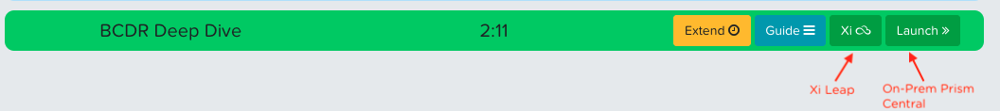

.. title:: My Recovery Deep Dive

.. toctree::
  :maxdepth: 2
  :caption: My Recovery Deep Dive
  :name: _xileap
  :hidden:

  index

.. toctree::
  :maxdepth: 2
  :caption: Appendix
  :name: _appendix
  :hidden:

------------------------------
Disaster Recovery ディープダイブ
------------------------------

従来のPrism Elementでのディザスターリカバリー構成は、保護ドメインとサードパーティの統合を使用してVMを保護し、オンプレミスのNutanixクラスター間でデータを複製します。 保護ドメインは、VMの起動順序を制御するなどのサポート操作の点で制限があり、アプリケーションの拡張などで新しいVMを保護するためには手動のタスクを実行する必要があります。

Leapは、エンティティ中心のアプローチとRunbookのような自動化を使用して、アプリケーションを回復します。 カテゴリを使用して、保護するエンティティをグループ化し、アプリケーションのスケーリングに応じて新しいエンティティの保護を自動化します。アプリケーションの復旧は、ネットワークマッピング、起動の順序や起動までのタイマー設定など柔軟に対応可能です。本番ワークロードに影響を与えることなく検証およびテストすることもできます。 フェイルオーバー時にアプリケーションが必要とするすべての構成情報はリカバリ先に同期されています。

2つの物理データセンター間、または物理データセンターとXi Leap Services間でLeapを使用できます。 Leapは、アベイラビリティーゾーンと呼ばれる物理的に分離された場所のペアで機能します。 1つのアベイラビリティーゾーンがアプリケーションのプライマリロケーションとして機能し、ペアのアベイラビリティーゾーンがリカバリロケーションとして機能します。 プライマリアベイラビリティゾーンはオンプレミスのPrism Centralインスタンスですが、リカバリアベイラビリティゾーンはオンプレミスまたはXi Leap Servicesのいずれかにすることができます。

**このラボでは、Xi Leap、保護ポリシーの構成、回復計画の作成、ネットワークの考慮事項の評価、フェイルオーバーの実行について学びます。**

.. _accessingleaplab:

ラボ環境へのアクセス
++++++++++++++++++++++++++++++

このラボでは、Nutanix Xi Leapクラスターと従来のオンプレミスNutanixクラスターの両方が必要です。

電子メールのリンクをクリックし、開いたブラウザでhttps://access.nutanixtestdrive.com に移動すると、環境にアクセスできます。

**BCDR Deep Dive** を確認します。

- **Launch** ボタンをクリックすると On-Prem Prism Centralに接続します
- **Xi** ボタンをクリックすると Xi Leap ダッシュボードに接続します

次のURLから手動でアクセスすることもできます:

- オンプレの Prism Central: td **xxxxxxxxxx** .nutanixtestdrive.com/console/ (**xxxxxxxxxx** の部分がアカウント固有になります)
- Xi Leap: td **xxxxxxxxxx** -xi.nutanixtestdrive.com/xi/#page/xi_dashboard

クラスタのペアリングの確認
+++++++++++++++++++++++++

**Availability Zones** 2つのサイトにまたがるNutanixクラスタ、またはXi Leap環境のどちらも、物理的に別のリソースグループを表します。 アベイラビリティーゾーン間で複製するには、最初にソースクラスタをターゲットのPrism CentralまたはXi Leap環境とペアにする必要があります。

#. **オンプレのPrism Central** で、 :fa:`bars` **> Administration > Availability Zones** をクリックします。

   .. figure:: images/new.png

#. **オンプレ** のクラスタは既にXi Leap上の **US-EAST-1A** とペアリングされています。

#. 必要に応じて **Connect to Availability Zone** をクリックして、どのような設定がペアリングに必要か確認します。

カテゴリの作成
+++++++++++++++++++

**Prism Central** の、 **Category** はキーバリューペアです。 カテゴリは、いくつかの基準（場所、製品レベル、アプリ名など）に基づいてエンティティ（VM、ネットワーク、イメージなど）に割り当てられます。 次に、さまざまなポリシーをカテゴリにマッピングして、適切な値を持つカテゴリをVMに適用できます。

たとえば、エンジニアリング、経理、人事などの値を持つ部門ごとのカテゴリがあるとします。 この場合、エンジニアリングと人事に適用される1つのバックアップポリシーと、財務のみに適用される財務専用のバックアップポリシーを作成できます。 カテゴリを使用すると、エンティティグループ全体にさまざまなポリシーを実装でき、Prism Centralからすべてのマッピング情報を確認できます。

#. **オンプレの Prism Central** 上で :fa:`bars` **> Virtual Infrastructure > Categories** をクリックします。

   .. figure:: images/4.png

#. **Demo** カテゴリを選択し、 **Actions > Update** をクリックします。

   .. figure:: images/5.png

#. カテゴリにすでに3つの値が設定されていることを確認します。 最後の値の横にある：fa： `plus-circle`アイコンをクリックして、新しい値を追加します。

   .. figure:: images/add_category.png

#. **Values** の列で **App-4** と入力して **Save** をクリックします。

   .. figure:: images/6.png

   次に、カテゴリをエンティティに割り当てる必要があります。

#. :fa:`bars` **> Virtual Infrastructure > VMs** をクリックします。

#. デプロイされたVMのIPアドレスをメモします。

#. **App-4** VMの横にあるチェックボックスをクリックし、[**Actions]> [Manage Categories**] をクリックします。

   .. figure:: images/manage_categories.png

#. 検索フィールドで、 **Demo: App-4** を指定し **Save** をクリックして、カテゴリをVMに適用します。

   .. figure:: images/7.png

保護ポリシーの更新
++++++++++++++++++++++++++

**Protection Policy** は目的のRPOとスナップショットポリシーを定義します。

#. **オンプレのPrism Central** 上で、 :fa:`bars` **> Policies > Protection Policies** をクリックします。

#. 既存ポリシーの **AppPR** の横のチェックボックスを選択し、 **Actions > Update** をクリックします。

   .. figure:: images/8.png

#. リモートとローカルのスナップショット保持に関するオプションを確認します:

   - **Linear**

     ローカルサイトとリモートサイトの両方で、シンプルなスナップショット管理方法を利用します。 特定のサイトの保持数をnに設定すると、n個の最新のスナップショットがそのサイトに保持されます。 たとえば、RPOが1時間で、ローカルサイトの保持数が48の場合、48個の最新のスナップショットが常に保持されます。

   - **Roll-up**

     指定されたRPO間隔の古いスナップショットが一定の期間経過したときに、指定された保持期間の単一のスナップショットにロールアップされます。たとえばロールアップ保持でRPOを1時間に設定、サイトでの保持時間を1年に設定した場合、そのサイトで最も古い24個の毎時バックアップは、完了時に1つの日次バックアップにロールアップされます。 さらに24時間ごとに、最も古い7つの毎日のバックアップは、毎週の完了時に1つの毎週バックアップにロールアップされ、4つの最も古い毎週のバックアップは、毎月の完了時に1つのバックアップにロールアップされ、12の最も古い毎月のバックアップ毎年の完了時に単一のバックアップにロールアップされます。1年後にはそのサイトに最新の毎時バックアップが24、最新の日次バックアップが7、最新の週次バックアップが4、最新の月次バックアップが12、年次バックアップが1つあります。ロールアップスナップショットの作成に使用されたスナップショットは破棄されます。

   次に新しいカテゴリが保護ポリシーに設定され、すべての **App-4** が設定されたVMにポリシーが共有されるようにします。

#. **Update** をクリックし、**Add Categories** で **Demo: App-4** を指定します。

   .. figure:: images/9.png

#. **Save** をクリックします。

リカバリプランの更新
++++++++++++++++++++++

A **Recovery Plan** は、電源投入の順番やネットワークマッピングなど、フェイルオーバーのためのRunbookを定義します。

#. **オンプレの Prism Central** で、 :fa:`bars` **> Policies > Recovery Plan** をクリックします。

#. 既存ポリシーの **AppRP** の横のチェックボックスを選択し、 **Actions > Update** をクリックします。

   .. figure:: images/10.png

#. **Next** をクリックします。リカバリプランとして、事前に設定されているVMの電源をオンにする順序を確認します。

#. **Power On Sequence** の下の **Add New Stage** をクリックして4番目のステージを追加します。

   .. figure:: images/11.png

#. ステージ間に遅延を追加するには2つのステージ間の **Add Delay** をクリックし、 **Seconds** の値を入力した後、 **Add** をクリックします。

#. 新しいステージの下にある **Add Entities** をクリックします。

   .. figure:: images/add_entities0.png

#. **Demo** カテゴリで **Demo: App-4** を探して選択し、 **Add** をクリックします。

   .. figure:: images/add_entities.png

#. **Next** をクリックします。

   **Network Settings** を使用すると、ローカルアベイラビリティゾーン（プライマリロケーション）のネットワークをリカバリロケーションのネットワークにマップできます。 フェイルオーバーが発生し、VMがリカバリ場所でリカバリされると、プライマリロケーションのネットワークにマップされているネットワークに配置されます。

   .. figure:: images/12.png

   左側はローカルにあるアベイラビリティゾーンになります。 左側で、**Production** と **Test** の両方のフェイルオーバーイベントに使用されるVMネットワークを指定します。 これらは、Xi Leap側の **Production** および **Test** ネットワークにマッピングされます。 復旧場所がオンプレミスのアベイラビリティゾーンである場合は、そのサイトに対応するVMネットワークを指定します。

   オプションでゲートウェイのIPアドレスとプレフィックスを指定できます。 Xi Leapでは、作成したサブネットを選択するか、ゲートウェイのIPアドレスとプレフィックス長を入力できます。 ゲートウェイIPアドレスとプレフィックス長を指定した場合、リカバリプランはフェイルオーバー時にサブネットを動的に作成し、フェイルバック後に動的に作成されたサブネットをクリーンアップします。 この機能は、Xi Leapを使用したDRの主要な利点です。Xi Leapにフェイルオーバーするときに各VMが元のIPアドレスを維持できるため、アプリケーションを再構成するためのRunbookスクリプトが大幅に削減されます。

   VMに **Floating IP** を割り当てることもできます。 これにより、パブリックインターネットからVMに直接アクセスできます。 フェイルオーバー時に、パブリックIPはNAT構成でVMに割り当てられます。

Xi Leapポータルの確認
+++++++++++++++++++++++++

#. :ref:`accessingleaplab` のXi Leapリンクを使用してXi Leapポータルに戻ります。

#. Xi Leapポータルに表示されている情報を見て、オンプレミスのPrism Centralと比較してください。

#. **Explore > Virtual Private Clouds** をクリックします。

   これは、Xi LeapでVPCを確認できる場所です。 **Production** または **Test** のいずれかをクリックすると、サブネットやVPNなどを構成できます。

#. **Production** をクリックします。

   最大100個の異なるサブネットを作成し、それらの間にポリシーベースのルーティングルールを構築できます。

#. **Manage VPN** をクリックします。

   .. figure:: images/manage_vpn.png

#. **Next** をクリックして、VPNの構成に必要な構成要件を表示します。

   ネットワーキングはあらゆるハイブリッドクラウド展開の最大の課題となる可能性がありますが、Nutanixは自動構成オプションを提供することにより、このプロセスの簡素化（および不要な専門サービスコストの削減）に努めています。 自動構成ウィザードをステップ実行すると、オンプレミス環境の構成を完了するために必要なすべてのコマンドも提供されます。

#. 右上にある **Xボタン** をクリックしてコンフィグレーションウィザードを閉じます。

#. 本当に閉じるか確認された場合は **Yes** をクリックします。

#. 右上にある **Xボタン** をクリックしてVPC設定画面を閉じます。

フェイルオーバーの実行
+++++++++++++++++++++

Leapは、次のタイプのフェイルオーバー操作をサポートしています。:

- **Test Failover**

  リカバリプランをテストする場合は、テストフェイルオーバーを実行します。 テストフェイルオーバーを実行すると、VMはテスト目的でリカバリ場所で指定された仮想ネットワーク（オンプレミスクラスターで手動で作成された仮想ネットワークとXi LeapのテストVPCの仮想サブネット）で起動されます。 ただし、プライマリロケーションのVMは影響を受けません。 テストフェールオーバーは、復旧場所にVMスナップショットがあるかどうかに依存します。

- **Planned Failover**

  プライマリロケーションでサービスを中断させる災害が予測されたときに、計画的なフェールオーバーを実行します。 計画的フェイルオーバーを実行すると、リカバリプランは最初に各VMのスナップショットを作成し、スナップショットをリカバリ場所に複製してから、リカバリ場所でVMを起動します。 したがって、計画的なフェイルオーバーが成功するには、VMがプライマリロケーションで使用可能である必要があります。 フェイルオーバープロセスでエラーが発生した場合は、エラー状態を解決できます。 計画的なフェイルオーバーの後、VMはソースアベイラビリティーゾーンで実行されなくなります。

  フェイルオーバー後、レプリケーションは逆方向に始まります。 計画的なフェイルオーバーの場合、MACアドレスは維持されます。

- **Unplanned Failover**

  プライマリロケーションで災害が発生した場合、計画外のフェイルオーバーを実行します。 計画外のフェイルオーバーでは、データの損失が発生することが予想されます。 可能な最大のデータ損失は、保護ポリシーで構成されたRPO、または特定のVMの最後の手動バックアップ後に生成されたデータと同じです。 計画外のフェイルオーバーでは、デフォルトで、VMは最新のスナップショットから復旧されます。 ただし、日付と時刻を選択することで、以前のスナップショットから回復できます。 エラーはログに記録されますが、フェイルオーバーの実行は続行されます。

  フェイルオーバー後、レプリケーションは逆方向に始まります。

この演習では、**計画されたフェイルオーバー** を実行します.

.. note::

   スナップショットがリカバリアベイラビリティゾーンに複製されている場合にのみ、計画外のフェイルオーバー操作を実行できます。リカバリ場所では、フェイルオーバー操作は過去にローカルで作成されたスナップショットを使用できません。たとえば、プライマリアベイラビリティーゾーンAZ1から復旧場所AZ2（Xi Leap）への計画されたフェイルオーバーを実行してから、AZ2からAZ1への計画外のフェイルオーバーを試行した場合、

#. **Xi Leapポータル** から **Explore > Recovery Plans** をクリックします。

#. リカバリプラン **AppRP** を選択し、 **Actions > Failover** をクリックします。

   .. figure:: images/14.png

#. このプランでフェイルオーバーの対象となるエンティティの数を確認して、 **Failover** をクリックしてください。

   .. figure:: images/15.png

#. リカバリプランが[**Running**]に更新されたら、[**AppRP**]をクリックし、[**Task**]を選択して現在のステータスを表示します。 さまざまなブートステージに注意して、フェイルオーバーの監視を続けます。

   .. figure:: images/16.png

#. フェイルオーバー操作が完了したら、サイドバーから[**VM**]を選択します。

#. 4つのVMがXi leap上で実行されていることを確認してください。

   .. figure:: images/18.png

フェイルバック
++++++++++++

リカバリサイトでの実行中に発生した変更を含め、プライマリサイトへのフェイルバックはDRワークフローの重要な部分です。

#. **オンプレのPrism Central** に戻り :fa:`bars` **> Policies > Recovery Plan** をクリックします。

#. **AppRP** プランを選択し、 **Actions > Failover** をクリックします。

#. フェイルバックする場合、 **Recovery Location** はプライマリサイトに向いている必要があります。 [ **Failover** ] をクリックします。

#. リカバリプランをクリックし、Prism Centralの同じUIにアクセスしてフェールバック操作を監視できることを確認します。

#. リカバリプランが完了したら、VMが再度実行されていることを確認します。

まとめ
+++++++++

- Xi Leapは、オンプレミスのNutanixクラスターに高速で簡単なクラウドDR機能を提供します
- Xi Leapは、自動VPNセットアップを提供することにより、ネットワーク要件を大幅に簡素化します
- Xi Leapで同じネットワークを利用できるため、VM Runbookが大幅に簡素化されます
- Xi Leapは、テスト、計画済み、および計画外のフェイルオーバー操作をサポートします
- Xi Leapからのフェイルバック操作では、運用手順書に特別な変更は必要ありません
- Prism CentralとXi Leapは、DR操作を管理および監視するための統合管理エクスペリエンスを提供します
- Leapは、複数のオンプレミスNutanix AHVクラスター間でネイティブDR機能を提供するためにも使用できます
